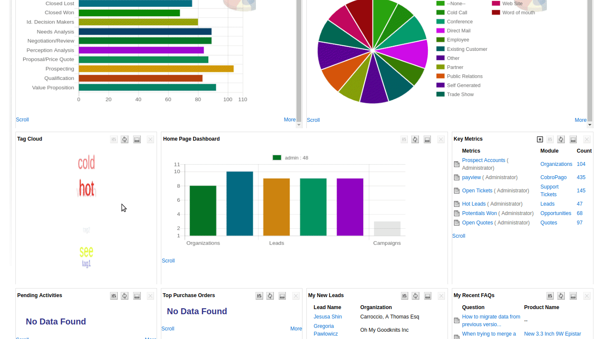
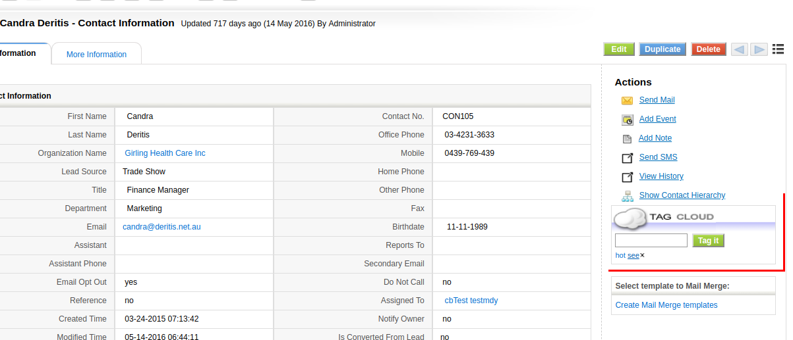
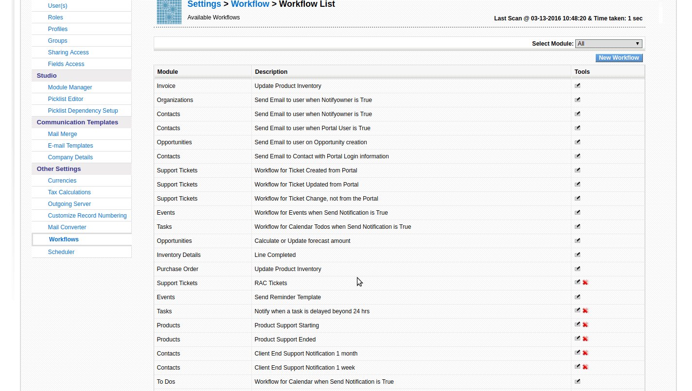

Tagging is an incredibly simple and powerful concept used in many applications and all social networks. Read this post to see how to use this feature in coreBOS.

===

By adding a tag to an object we automatically create an implicit category where any heterogeneous set of objects can be grouped. We can mix any type of object into the set defined by the tag.

The wiki definition is very helpful and clear.

> A tag is a keyword or term assigned to a piece of information (such as a digital image, database record, or computer file). This kind of metadata helps describe an item and allows it to be found again by browsing or searching. Tags are generally chosen informally and personally by the item's creator or by its viewer.

The coreBOS tagging system permits us to apply this concept and define sets of records from any module and then list them together.

The applications of tagging are many, for example:

 - **category of records**. If the users of the application need to group records inside a given module, the administrator must create a picklist and add the possible values, if a new value is required the users have to wait for the administrator to add it to the picklist. With tagging, this categorization can be accomplished without depending on the picklist and, additionally, one record can have more than one value.
 - **case management**. When a user is working on some case like trying to get payments, he can group all the related records together with a tag so he could quickly see the invoice, the project, the payments and the calendar events all grouped under one tag.

Now let's move on to see how this works in coreBOS

Tagging is activated per user in their preferences tab. You can also define how you want the home page tag cloud to move.



Once active, the tagging widget appears in the right side action panel where we will be able to apply tags as well as see a list of the already applied ones. We can also eliminate any tag in the widget.



By clicking on the tag we will be taken to a search screen that will show us all the records that have this tag.

We can also search for tags using the global search box with the prefix **tag::** like this

```
tag::cobrarfra
```

We can also mass apply and eliminate tags from the list view as we do with other mass actions.


We can use workflows to apply and eliminate tags automatically based on any condition supported by the powerful workflow system



Finally, on the home page, we can find a tag cloud that shows us all the tags in the system and where we can click on any tag to get directed to the list of records.

If you have the marketing dashboard you can also use these tags to launch mailings and other mass actions permitted by this extension.

**<span style="font-size:large">Let us know how you use tags.</span>**

