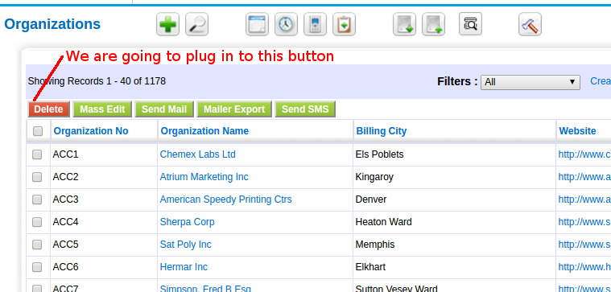
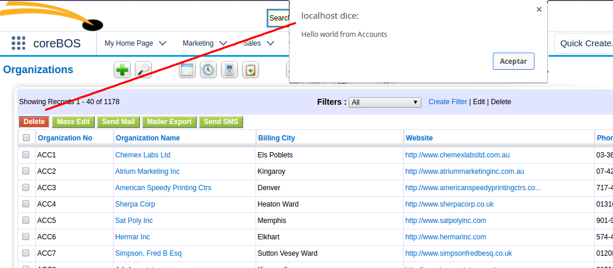

Looking for a way to add some functionality to an existing javascript function in coreBOS? We have exactly what you are looking for.

===

coreBOS is a web-based application, as such, it is like two applications in constant synchronization. One is the front end that you see in the browser which is written in JavaScript and the other is the backend which is written in PHP.

In [February 2015](../February2015) we added an eventing system to the PHP application so developers could add their logic into the existing functionality.

In [March 2015](../March2015) we add something similar to the JavaScript application. We add a class that permits the developer to plug in their functionality into any coreBOS function or class method. This function is called **corebosjshook** and it will permit us to launch our own code **before** or **after** the selected function or **completely override** it with our own code.

This functionality is based on an [aspect-oriented programming](https://en.wikipedia.org/wiki/Aspect-oriented_programming) approach implemented by Brian Cavalier and John Hann as part of the [cujoJS](http://cujojs.com/) set of libraries.

Let's see an example of how to use this class in coreBOS.

I am going to pick the **massDelete** JavaScript function which is executed when you click on the "Delete" button on any list view and add a simple "Hello world" message.



First we need a place where we can load our own JavaScript code, this is done using the coreBOS PHP action links as explained in the [How to add action links to a module](http://corebos.org/documentation/doku.php?noprocess=1&id=en:devel:add_actions) development tutorial and looks like this:

```
include_once('vtlib/Vtiger/Module.php');
$module = Vtiger_Module::getInstance('Accounts');
$module->addLink('FOOTERSCRIPT', 'corebosjshookexample', 'corebosjshookexample.js', '', 1, null, TRUE);
```

 ! We put the code in the footer to make sure it loads after all the other functions we need to plug into.

After executing that code any JavaScript we put inside the file _corebosjshookexample.js_ will be loaded and executed in the browser, so our first version will simply output the message always so we make sure it is loaded correctly.

```
alert('Hello world');
```

Our next version will add the message before the mass delete function:

```
function massdeleteBeforeHelloWorld(module) {  // use the same signature as the function we override
  alert('BEFORE: Hello world from ' + module);
}
var beforemassdelete = corebosjshook.before('massDelete',massdeleteBeforeHelloWorld);
```

Now after

```
function massdeleteAfterHelloWorld(module) {  // use the same signature as the function we override
  alert('AFTER: Hello world from ' + module);
}
var aftermassdelete = corebosjshook.after(window,'massDelete',massdeleteAfterHelloWorld);
```

Finally, we completely override the whole function and call it from our own function

```
function massdeleteAroundHelloWorld(jpoint) {
  console.log(jpoint);
  alert('AROUND: Hello world');
  jpoint.proceed(jpoint.args[0]);
}
var onmassdelete = corebosjshook.around(window,'massDelete',massdeleteAroundHelloWorld);
```



 !!! You can [find the code on this gist.](https://gist.github.com/joebordes/bb2e74f5dcedfa247451e378730438bc)

As shown, it is very simple to plug in functionality into any existing function or class method and we barely skimmed the possibilities in this article. You can see a few examples in the [tax module](../AdvancedTax) and get some more information at [the meld library reference](https://github.com/cujojs/meld/blob/master/docs/reference.md), [the meld library API](https://github.com/cujojs/meld/blob/master/docs/api.md) and [our documentation page](http://corebos.org/documentation/doku.php?noprocess=1&id=en:devel:corebosjshooks).

Join our [developer discussions on gitter](https://gitter.im/corebos/discuss) and ask about any doubts you may have.

