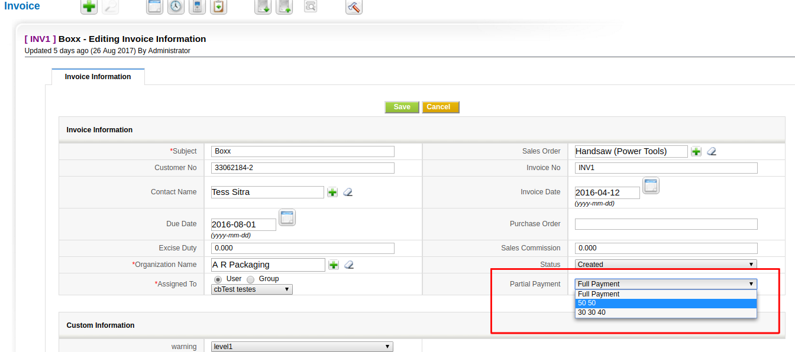

A very common use case in business software applications is to have a set of defined steps or a procedure to follow when an event happens. The implementation pattern explained here shows how to do this in coreBOS.

===

 ! Common Use Cases

Let's start with a few examples of situations where this pattern can be used.
 - Support tickets. Our company has a set of typical tickets that have a series of steps that must be taken
 - Claims resolution, where the quality control team needs to comply with standards and follow the defined set of steps
 - Project and project task for very well defined and controlled projects
 - Purchase acquisition and reception procedure
 - Partial payment control
 - ...

 

 ! Control Partial Payments of Invoices

Now let's dive into the "_control partial payments of invoices_" example because it is one of the most demanded in coreBOS.

The goal is simple and extremely common. The solution is also simple and extremely powerful as coreBOS has full support for this pattern.

 !!! We have invoices that are paid fractioned on different dates. We need to control the dates and status of each payment.

Let's suppose that we have a payment form picklist on our invoice with different payment options we support in our company.

The selection of this picklist defines the dates and number of partial payments we will receive. For this example I am going to suppose that our business rules are:
 - **Full Payment:** just one payment on invoice due date for the full amount
 - **50 50:** one payment on the creation of the invoice and the other payment on the due date. Each payment will be 50% of the total amount.
 - **30 30 40:** one payment on the creation of the invoice, another 30 days after the creation and the last payment on the due date. The first two payments will be 30% of total amount and the last will be the 40% pending.

Our first requirement will be to create the partial payment records depending on the value of this picklist.

This can be done using the **create entity workflow task**. We will create a workflow upon the invoice module for each different payment option we support in our company that will add payment records on the defined dates with the corresponding amounts.

Once the records have been created we can establish other workflows to notify of the payment, create reports of past due payments and any other payment control work that we want to establish in our company.

There isn't much more to it, the **event** is some **module** upon which we will create a workflow and the **related steps** are in a **related module** for which we will create records with the _create entity workflow task_.

But there is one more issue we need to pay attention to, which is the case that the user incorrectly selected the wrong payment form value or the client asks to change that form of payment. In this case, we must eliminate the existing records and create a new set of steps. The **_delete related records task_** is there exactly to cover this event. This workflow task will eliminate all the related records of a given type that belong to a record.

To accomplish this it is of utmost importance that we delete **before** adding the new records or else we could delete the records we just created.

This pattern gets a little bit more complicated because we must also control if one or more of the payment records have already been paid when the payment method change occurs on the invoice. In this case, we cannot delete a payment record already marked as paid. Additionally, we should also control the use case where a user deletes a payment record which would leave the configuration in an inconsistent state. Both of these cases can be controlled in coreBOS using the validation system. We would put limitations on the actions users may take on the payment records depending on the settings. This isn't directly related to the pattern we discuss here but they are things you should consider when configuring this in your company. 

Have a look at this video to see this example in action.

[plugin:youtube](https://youtu.be/7cNdxjmvN9Y)

Let me know how you are using this pattern.

**Thanks for reading.**

